<details>

<summary> Metrics are currently broken :( </summary>



</details>

So **Tokei** + **filtration** will have to do for now.

```bash
# Everything I've ever made, ever, published, unpublished, work related,
# org related, private, public, throwaway, practice, codewars, exercism..

# Note: some languages are overblown, e.g. C and C Header, so they are
# not included. The ones that are included are still off but within a
# rasonable margin of error, unlike, the 7 million in C, even though I
# have written more C++ than C, and C++ (code not lines) is closer to
# 190,000 not 323,195 but at elast it doesn't say 8,792,507 (C) lol

# Until I decide to fix metrics myself, this will have to do as a
# temporary placeholder. A testament to the love of
# programming language theory,

# Filtered to the languages I actively have an interest in, even if they
# do not appear in the list, eventually they will :)

# I have my eyes on you Forth, APL, BMQ, and Ada. I'm watching.

tokei -C -t=rust,c++,c,c\ header,haskell,go,lua,python,fish,bash,ruby,zsh,shell,\
            kotlin,zig,elixir,erlang,apl,bqm,ada \

                          ~/source/github/PsychedelicShayna \  #   2025-2026
                          ~/source/eternal0000ff/first-party \ #   2023-2024
                          ~/source/fromdropbox                 # < 2023 (old)

===============================================================================
 Language            Files        Lines         Code     Comments       Blanks
===============================================================================
 BASH                   27         8763         6404         1119         1240
 C++                  1155       437892       323195        47266        67431
 Elixir                 24         1524         1116          146          262
 Fish                   14          670          485           83          102
 Go                    114        12499         8545         1964         1990
 Haskell               211        10941         7216         2071         1654
 Kotlin                 14         2005         1574           30          401
 Lua                   553        33429        23335         5599         4495
 Python               2492       626005       497204        43999        84802
 Ruby                   20         2040         1446          266          328
 Rust                  289        60778        54022         2830         3926
 Shell                 703        79365        58667        10921         9777
 Zsh                     1          355          286            9           60
===============================================================================
 Total                5617      1276266       983495       116303       176468
===============================================================================

# 983,495 lines of code throughout my entire life doesn't feel that far off.
# give or take 200,000 lines.

```


